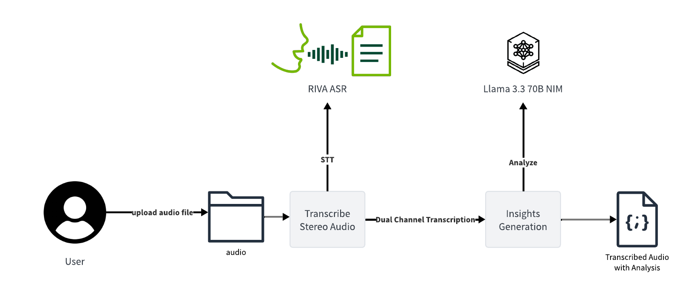

# Contact Center Insights

This repository serves as a demonstration of the Insights IQ service, showcasing its core functionality of extracting actionable insights from customer-agent interactions. The sample project focuses on a single call recording, illustrating the end-to-end process of transcription and AI-driven analysis.

## Key Features

- **Call Transcription:** Utilize NVIDIA Riva to transcribe audio calls with parakeet CTC 1.1b ASR model.
- **Insight Generation:** Use LangChain and NVIDIA NIM Llama 3.3 70B to generate structured output containing key entities and agent performance evaluation metrics.

## Architecture

Contact Center Insights generation involves two steps:

1. **Transcription with speaker Diarization**
   - **NVIDIA Riva Integration:** Transcribes incoming audio calls between two speakers using NVIDIA Riva's Parakeet CTC 1.1b ASR model and creates a structured transcript.

2. **Insight Generation**
   - **Entity Extraction:** Extracts key entities like customer and agent names, topic and subtopic of the conversation.
    - **Agent Performance Evaluation:** Evaluates agent performance based several key metrics.
    - **Combine Insights:** Combines all extracted insights into a structured JSON.

## Getting Started

### Prerequisites

1. Python 3.11+
2. NVIDIA RIVA API keys
3. NVIDIA Llama NIM API keys
4. Audio file with 2 speakers in the `audio/` folder

### Installation

1. Clone this repository
2. Install the dependencies using `pip install -r requirements.txt`
3. Set the environment variables in the `.env` file as per the `.env.example` file (see below for setting up NVIDIA API keys)
4. Run the Jupyter notebook
5. Insights for call audio in `audio/` folder will be generated and stored in the `insights/` folder

### Setting up NVIDIA API keys

Prior to getting started, you will need to obtain API keys to access the NVIDIA NIM hosted services for the Parakeet CTC 1.1b ASR model and the NIM Llama 3.3 70B model.

1. Getting parakeet CTC 1.1b ASR model API key
   - Visit the Parakeet CTC 1.1b ASR  [model page](https://build.nvidia.com/nvidia/parakeet-ctc-1_1b-asr/modelcard)
   - Click on 'Build with this NIM'  and follow the instructions to get the API key
   - Add `NVIDIA_NIM_PARAKEET_API_KEY` to the `.env` file

2. Getting Llama 3.3 70B model API key
   - Visit the Meta Llama 3.3 70B [model page](https://build.nvidia.com/meta/llama-3_3-70b-instruct/modelcard)
   - Click on 'Build with this NIM' and follow the instructions to get the API key
   - Add `NVIDIA_NIM_LLAMA_API_KEY` to the `.env` file
